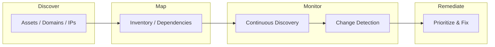

# Attack Surface Management

- [Resources](#resources)
- [Attack Surface Management Flowchart](#attack-surface-management-flowchart)

## Table of Contents

- [Attack Surface Management Flowchart](#attack-surface-management-flowchart)

## Attack Surface Management Flowchart

> **Read more:** For additional tools and references, see [Resources](#resources) below.

## Resources

| Name | Description | URL |
| --- | --- | --- |
| BlueHound | BlueHound is an open-source tool that helps blue teams pinpoint the security issues that actually matter. | https://github.com/zeronetworks/BlueHound |
| Crossfeed | External monitoring for organization assets | https://github.com/cisagov/crossfeed |
| Cymulate | Exposure Management & Security Validation Platform | https://cymulate.com |
| Darktrace | Proactive cybersecurity across the enterprise | https://darktrace.com |
| FalconHound | FalconHound is a blue team multi-tool. | https://github.com/FalconForceTeam/FalconHound |
| Forest Druid | Stop chasing AD attack paths. Focus on your Tier 0 perimeter. | https://www.purple-knight.com/forest-druid |
| GitMonitor | One way to continuously monitor sensitive information that could be exposed on Github. | https://github.com/Talkaboutcybersecurity/GitMonitor |
| Goby | Attack surface mapping | https://github.com/gobysec/Goby |
| Monkey365 | Monkey365 provides a tool for security consultants to easily conduct not only Microsoft 365, but also Azure subscriptions and Azure Active Directory security configuration reviews. | https://github.com/silverhack/monkey365 |
| OPSWAT | Cybersecurity platform | https://www.opswat.com |
| PlumHound | Bloodhound for Blue and Purple Teams | https://github.com/PlumHound/PlumHound |
| Purple Knight | #1 Active Directory security assessment community tool | https://www.purple-knight.com |
| RedHunt Labs | 360° Attack Surface Management | https://redhuntlabs.com |
| SaaS Attack Techniques | Offensive security drives defensive security. We're sharing a collection of SaaS attack techniques to help defenders understand the threats they face. #nolockdown | https://github.com/pushsecurity/saas-attacks |
| Sn1per | Attack Surface Management Platform | https://github.com/1N3/Sn1per |

---

## More contents

| Subject | Description |
| --- | --- |
| Additional resources | See Resources table for ASM tools and platforms. |
| ASM workflow | Discover → Map → Monitor → Remediate; see flowchart. |

## More tables

| Reference | Location |
| --- | --- |
| Tool matrix | See Resources table (BlueHound, Goby, Sn1per, etc.). |
| Frameworks | Purple Knight, Forest Druid, Monkey365 in Resources. |

## Tools and commands

| Category | Example |
| --- | --- |
| Discovery / mapping | See Resources for tool-specific docs and CLI. |
| Monitoring | Crossfeed, GitMonitor; see Resources links. |

## Payloads table

| Type | Description | Reference |
| --- | --- | --- |
| Discovery inputs | Domains, IP ranges, asset lists | See Resources; use with Goby, Sn1per. |
| Mapping output | Inventories, dependency maps | See Resources (BlueHound, PlumHound). |

---

## Connections

**Tamilselvan Cybersecurity** — Connect · Network:

| Resource | Link |
| --- | --- |
| GitHub | https://github.com/Tamilselvan-S-Cyber-Security |
| Website | https://tamilselvan-official.web.app/ |
| LinkedIn | https://in.linkedin.com/in/tamil-selvan-383618304 |
