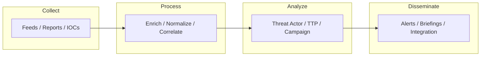

# Cyber Threat Intelligence

- [Resources](#resources)
- [Cyber Threat Intelligence Flowchart](#cyber-threat-intelligence-flowchart)

## Table of Contents

- [Cyber Threat Intelligence Flowchart](#cyber-threat-intelligence-flowchart)

## Cyber Threat Intelligence Flowchart

> **Read more:** For additional tools and references, see [Resources](#resources) below.

## Resources

| Name | Description | URL |
| --- | --- | --- |
| AlienVault | The World’s First Truly Open Threat Intelligence Community | https://otx.alienvault.com |
| APTMap | Advanced Persistent Threat Map | https://andreacristaldi.github.io/APTmap |
| C2 Tracker | Live Feed of C2 servers, tools, and botnets | https://github.com/montysecurity/C2-Tracker |
| C2IntelFeeds | Automatically created C2 Feeds | https://github.com/drb-ra/C2IntelFeeds |
| Cisco Talos Intelligence Group | Comprehensive Threat Intelligence | https://talosintelligence.com |
| CloudSEK | Security Threat Intelligence Platform | https://www.cloudsek.com |
| CrowdSec | Open-source and participative IPS able to analyze visitor behavior & provide an adapted response to all kinds of attacks. | https://github.com/crowdsecurity/crowdsec |
| Cyber Threat Intelligence | Real-Time Threat Monitoring. | https://start.me/p/wMrA5z/cyber-threat-intelligence |
| MISP | Open Source Threat Intelligence Platform | https://www.misp-project.org |
| OpenCTI | Open Cyber Threat Intelligence Platform | https://github.com/OpenCTI-Platform/opencti |
| Pulsefive | Threat Intelligence | https://pulsedive.com |
| SecurityTrails | Data Security, Threat Hunting, and Attack Surface Management | https://securitytrails.com |
| ThreatBook CTI | ThreatBook Intelligence | https://threatbook.io |
| The Shadowserver Foundation | The Shadowserver Foundation is a nonprofit security organization working altruistically behind the scenes to make the Internet more secure for everyone. | https://www.shadowserver.org |
| threatfeads.io | Free and open-source threat intelligence feeds. | https://threatfeeds.io |
| Threat Intelligence Platform (TIP) | Build Your Threat Intelligence Platform With Our APIs | https://threatintelligenceplatform.com |
| ThreatIntel-Reports | Raw data from Threat Intelligence Reports with automatic reports collection and keyword search across thousands of reports | https://github.com/mthcht/ThreatIntel-Reports |
| Threatview.io | Actionable cyber threat intelligence feeds | https://threatview.io |
| Yeti | Your Everyday Threat Intelligence | https://github.com/yeti-platform/yeti |
| Tamilselvan Cybersecurity | Connect · Network | https://github.com/Tamilselvan-S-Cyber-Security |
| Tamilselvan - Website | Personal portfolio & resources | https://tamilselvan-official.web.app/ |
| Tamilselvan - LinkedIn | Professional profile | https://in.linkedin.com/in/tamil-selvan-383618304 |

## Payloads table

| Type | Description | Reference |
| --- | --- | --- |
| IOCs / feeds | MISP, OpenCTI, AlienVault OTX | See Resources table. |
| Threat reports | C2 Tracker, ThreatIntel-Reports | See Resources; enrich and correlate. |
