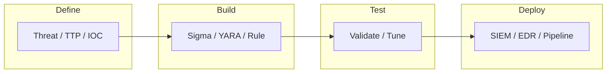

# Detection Engineering

- [Resources](#resources)
- [Detection Engineering Flowchart](#detection-engineering-flowchart)

## Table of Contents

- [Detection Engineering Flowchart](#detection-engineering-flowchart)
- [YARA](#yara)
- [yarGen](#yargen)

## Detection Engineering Flowchart



> **Read more:** For additional tools and references, see [Resources](#resources) below.

## Resources

| Name | Description | URL |
| --- | --- | --- |
| Detection Studio | Convert Sigma rules to SIEM queries, directly in your browser. | https://github.com/northsh/detection.studio |
| Laurel | Transform Linux Audit logs for SIEM usage | https://github.com/threathunters-io/laurel |
| SIGMA | Generic Signature Format for SIEM Systems | https://github.com/SigmaHQ/sigma |
| sysmon-config | Sysmon configuration file template with default high-quality event tracing | https://github.com/SwiftOnSecurity/sysmon-config |
| Unvoder IO | Detection Engineering IDE | https://uncoder.io |
| YARA | The pattern matching swiss knife | https://github.com/VirusTotal/yara |
| yarGen | yarGen is a generator for YARA rules | https://github.com/Neo23x0/yarGen |
| Tamilselvan Cybersecurity | Connect · Network | https://github.com/Tamilselvan-S-Cyber-Security |
| Tamilselvan - Website | Personal portfolio & resources | https://tamilselvan-official.web.app/ |
| Tamilselvan - LinkedIn | Professional profile | https://in.linkedin.com/in/tamil-selvan-383618304 |

## YARA

### Installation

> https://yara.readthedocs.io/en/stable/gettingstarted.html

> https://github.com/VirusTotal/yara/releases

```console
$ sudo apt-get install automake libtool make gcc pkg-config
```

```console
$ sudo apt-get install flex bison
```

```console
$ ./bootstrap.sh
```

```console
$ ./configure
```

```console
$ make
```

```console
$ sudo make install
```

```console
$ make check
```

```console
$ ./configure --enable-magic
```

```console
$ yara /PATH/TO/yarGen/yarGen-0.23.4/yargen_rules.yar /PATH/TO/BINARY/<BINARY> -s <BINARY> /PATH/TO/BINARY/<BINARY>
```

## yarGen

> https://github.com/Neo23x0/yarGen

```console
$ mkdir yarGen
```

```console
$ cd yarGen/
```

```console
$ wget https://github.com/Neo23x0/yarGen/archive/refs/tags/0.23.4.zip
```

```console
$ unzip 0.23.4.zip
```

```console
$ cd yarGen-0.23.4/
```

```console
$ python3 -m venv venv
```

```console
$ source venv/bin/activate
```

```console
$ pip install -r requirements.txt
```

```console
$ python3 yarGen.py --update
```

```console
$ mkdir sample
```

```console
$ cp rusty-recon-bot sample/
```

```console
$ python3 yarGen.py -a "<AUTHOR>" -r "<NAME>" -m sample/
```

---

## More contents

| Subject | Description |
| --- | --- |
| Additional resources | See Resources (Sigma, YARA, Detection Studio, Laurel). |
| Detection flow | Define → Build → Test → Deploy; see flowchart. |

## More tables

| Reference | Location |
| --- | --- |
| YARA / Sigma | See Resources and YARA, yarGen sections. |
| Sysmon / Laurel | See Resources for config and log transform. |

## Tools and commands

| Category | Example |
| --- | --- |
| YARA | See YARA section for install and scan syntax. |
| yarGen | `python3 yarGen.py -a "<AUTHOR>" -r "<NAME>" -m sample/` — see section above. |

## Payloads table

| Type | Description | Reference |
| --- | --- | --- |
| YARA / Sigma | Rule payloads, detection logic | See YARA, yarGen sections; Resources (Sigma). |
| Test samples | Malware samples, IOCs for testing | Use with yarGen -m sample/; see Resources. |

---

## Connections

**Tamilselvan Cybersecurity** — Connect · Network:

| Resource | Link |
| --- | --- |
| GitHub | https://github.com/Tamilselvan-S-Cyber-Security |
| Website | https://tamilselvan-official.web.app/ |
| LinkedIn | https://in.linkedin.com/in/tamil-selvan-383618304 |
