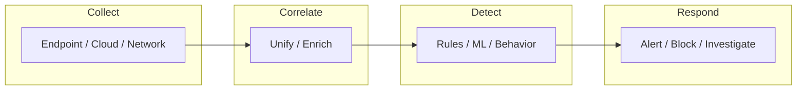

# EDR & XDR

- [Resources](#resources)
- [EDR & XDR Flowchart](#edr--xdr-flowchart)

## Table of Contents

- [EDR & XDR Flowchart](#edr--xdr-flowchart)

## EDR & XDR Flowchart

> **Read more:** For additional tools and references, see [Resources](#resources) below.

## Resources

| Name | Description | URL |
| --- | --- | --- |
| OpenEDR | Open Source Endpoint Detection and Response (EDR) | https://www.openedr.com |
| Vectra | Advanced AI Security | https://www.vectra.ai |
| Wazuh | Wazuh - The Open Source Security Platform. Unified XDR and SIEM protection for endpoints and cloud workloads. | https://github.com/wazuh/wazuh |

---

## More contents

| Subject | Description |
| --- | --- |
| Additional resources | See Resources table (OpenEDR, Vectra, Wazuh). |
| EDR/XDR flow | Collect → Correlate → Detect → Respond; see flowchart. |

## More tables

| Reference | Location |
| --- | --- |
| Platforms | See Resources for endpoint and unified XDR tools. |
| Integration | SIEM, SOAR; see related handbooks. |

## Tools and commands

| Category | Example |
| --- | --- |
| Deployment | See vendor docs in Resources table. |
| Query / rules | Platform-specific; see Wazuh, OpenEDR docs. |

## Payloads table

| Type | Description | Reference |
| --- | --- | --- |
| Detection rules | EDR/XDR rules, queries | See vendor docs in Resources table. |
| Test payloads | Evasion, execution tests | See Evasion, Malware Development handbooks. |

---

## Connections

**Tamilselvan Cybersecurity** — Connect · Network:

| Resource | Link |
| --- | --- |
| GitHub | https://github.com/Tamilselvan-S-Cyber-Security |
| Website | https://tamilselvan-official.web.app/ |
| LinkedIn | https://in.linkedin.com/in/tamil-selvan-383618304 |
