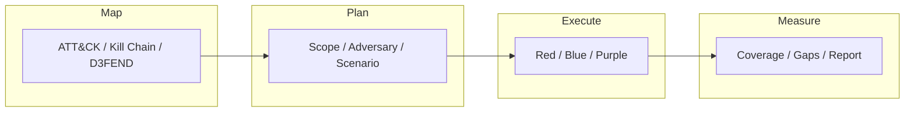

# Frameworks

- [Resources](#resources)
- [Frameworks Flowchart](#frameworks-flowchart)

## Table of Contents

- [Frameworks Flowchart](#frameworks-flowchart)

## Frameworks Flowchart

> **Read more:** For additional tools and references, see [Resources](#resources) below.

## Resources

| Name | Description | URL |
| --- | --- | --- |
| Atomic Red Team | Atomic Red Team™ is a library of tests mapped to the MITRE ATT&CK® framework. Security teams can use Atomic Red Team to quickly, portably, and reproducibly test their environments. | https://github.com/redcanaryco/atomic-red-team |
| Caldera | CALDERA™ is a cyber security platform designed to easily automate adversary emulation, assist manual red-teams, and automate incident response. | https://github.com/mitre/caldera |
| Lockheed Martin Cyber Kill Chain | Developed by Lockheed Martin, the Cyber Kill Chain® framework is part of the Intelligence Driven Defense® model for identification and prevention of cyber intrusions activity. | https://www.lockheedmartin.com/en-us/capabilities/cyber/cyber-kill-chain.html |
| MITRE D3FEND™ | A knowledge graph of cybersecurity countermeasures | https://d3fend.mitre.org |
| MITRE ATLAS™ | MITRE ATLAS™ (Adversarial Threat Landscape for Artificial-Intelligence Systems) is a globally accessible, living knowledge base of adversary tactics and techniques based on real-world attack observations and realistic demonstrations from AI red teams and security groups. | https://atlas.mitre.org |
| MITRE ATT&CK® Navigator | The ATT&CK Navigator is a web-based tool for annotating and exploring ATT&CK matrices. It can be used to visualize defensive coverage, red/blue team planning, the frequency of detected techniques, and more. | https://mitre-attack.github.io/attack-navigator |
| OWASP Threat Dragon | Threat Dragon is a free, open-source, cross-platform threat modeling application including system diagramming and a rule engine to auto-generate threats/mitigations. | https://github.com/mike-goodwin/owasp-threat-dragon-desktop |
| The Unified Kill Chain | Raising resilience against advanced cyber attacks through threat modeling. | https://unifiedkillchain.com |
| TIBER-EU | TIBER-EU is a European framework for threat intelligence-based ethical red-teaming. It provides comprehensive guidance on how authorities, entities, and threat intelligence and red-team providers should work together to test and improve the cyber resilience of entities by carrying out controlled cyberattacks. | https://www.ecb.europa.eu/pub/pdf/other/ecb.tiber_eu_framework.en.pdf |
| VECTR | VECTR is a tool that facilitates tracking of your red and blue team testing activities to measure detection and prevention capabilities across different attack scenarios. | https://github.com/SecurityRiskAdvisors/VECTR |

---

## More contents

| Subject | Description |
| --- | --- |
| Additional resources | See Resources (ATT&CK, Caldera, Atomic Red Team, etc.). |
| Framework use | Map → Plan → Execute → Measure; see flowchart. |

## More tables

| Reference | Location |
| --- | --- |
| ATT&CK / Kill Chain | See Resources for Navigator, D3FEND, TIBER-EU. |
| Emulation | Atomic Red Team, Caldera, VECTR in Resources. |

## Tools and commands

| Category | Example |
| --- | --- |
| Atomic Red Team | See Simulation & Emulation handbook. |
| Caldera / Navigator | See Resources table for links and usage. |

## Payloads table

| Type | Description | Reference |
| --- | --- | --- |
| Emulation payloads | ATT&CK techniques, atomic tests | See Atomic Red Team, Caldera; Simulation & Emulation handbook. |
| Navigator layers | Matrix export, coverage maps | See MITRE ATT&CK Navigator in Resources. |

---

## Connections

**Tamilselvan Cybersecurity** — Connect · Network:

| Resource | Link |
| --- | --- |
| GitHub | https://github.com/Tamilselvan-S-Cyber-Security |
| Website | https://tamilselvan-official.web.app/ |
| LinkedIn | https://in.linkedin.com/in/tamil-selvan-383618304 |
