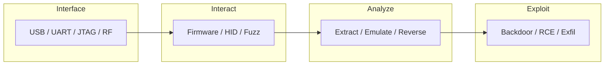

# Hardware

- [Resources](#resources)
- [Hardware Flowchart](#hardware-flowchart)

## Table of Contents

- [Hardware Flowchart](#hardware-flowchart)
- [ATtiny85](#attiny85)
- [Signal Decoding](#signal-decoding)

## Hardware Flowchart



> **Read more:** For additional tools and references, see [Resources](#resources) below.

## Resources

| Name | Description | URL |
| --- | --- | --- |
| Attiny85 | RubberDucky like payloads for DigiSpark Attiny85 | https://github.com/MTK911/Attiny85 |
| Bash-RF PI | Script with several tools to brute force garages, hack radio stations and capture and analyze radio signals with Raspberry Pi | https://github.com/Lucstay11/Brute-force-garage-and-hack-rf |
| Firmware Analysis Toolkit | Toolkit to emulate firmware and analyse it for security vulnerabilities | https://github.com/attify/firmware-analysis-toolkit |
| HardwareAllTheThings | Hardware/IOT Pentesting Wiki | https://github.com/swisskyrepo/HardwareAllTheThings |
| OWASP Firmware Security Testing Methodology | FSTM is composed of nine stages tailored to enable security researchers, software developers, hobbyists, and Information Security professionals with conducting firmware security assessments. | https://scriptingxss.gitbook.io/firmware-security-testing-methodology |
| P4wnP1 A.L.O.A. | P4wnP1 A.L.O.A. by MaMe82 is a framework which turns a Rapsberry Pi Zero W into a flexible, low-cost platform for pentesting, red teaming and physical engagements ... or into "A Little Offensive Appliance". | https://github.com/RoganDawes/P4wnP1_aloa |
| P4wnP1 by MaMe82 | P4wnP1 is a highly customizable USB attack platform, based on a low cost Raspberry Pi Zero or Raspberry Pi Zero W (required for HID backdoor). | https://github.com/RoganDawes/P4wnP1 |
| rtl_433 | Program to decode radio transmissions from devices on the ISM bands (and other frequencies) | https://github.com/merbanan/rtl_433 |
| saleae | Logic Analyzer | https://discuss.saleae.com/ |
| Tamilselvan Cybersecurity | Connect · Network | https://github.com/Tamilselvan-S-Cyber-Security |
| Tamilselvan - Website | Personal portfolio & resources | https://tamilselvan-official.web.app/ |
| Tamilselvan - LinkedIn | Professional profile | https://in.linkedin.com/in/tamil-selvan-383618304 |

## ATtiny85

### udev Rule

```console
$ sudo vi /etc/udev/rules.d/49-micronucleus.rules
```

```console
# UDEV Rules for Micronucleus boards including the Digispark.
# This file must be placed at:
#
# /etc/udev/rules.d/49-micronucleus.rules    (preferred location)
#   or
# /lib/udev/rules.d/49-micronucleus.rules    (req'd on some broken systems)
#
# After this file is copied, physically unplug and reconnect the board.
#
SUBSYSTEMS=="usb", ATTRS{idVendor}=="16d0", ATTRS{idProduct}=="0753", MODE:="0666"
KERNEL=="ttyACM*", ATTRS{idVendor}=="16d0", ATTRS{idProduct}=="0753", MODE:="0666", ENV{ID_MM_DEVICE_IGNORE}="1"
#
# If you share your linux system with other users, or just don't like the
# idea of write permission for everybody, you can replace MODE:="0666" with
# OWNER:="yourusername" to create the device owned by you, or with
# GROUP:="somegroupname" and mange access using standard unix groups.
```

### Additonal Packages

```console
https://raw.githubusercontent.com/digistump/arduino-boards-index/master/package_digistump_index.json
```

### Board

```console
Digispark (Default - 16.5mhz)
```

## Signal Decoding

### rtl433 / cf32

> https://github.com/merbanan/rtl_433

> https://triq.org/

```console
$ rtl_433 -r <FILE>.cf32 -A
```

---

## More contents

| Subject | Description |
| --- | --- |
| Additional resources | See Resources (Firmware Analysis Toolkit, P4wnP1, rtl_433). |
| Hardware flow | Interface → Interact → Analyze → Exploit; see flowchart. |

## More tables

| Reference | Location |
| --- | --- |
| ATtiny85 / DigiSpark | See ATtiny85 section for udev and payloads. |
| Signal decoding | rtl_433; see Signal Decoding section. |

## Tools and commands

| Category | Example |
| --- | --- |
| rtl_433 | `rtl_433 -r <FILE>.cf32 -A` — see Signal Decoding. |
| ATtiny85 | See ATtiny85 section for micronucleus and udev. |

## Payloads table

| Type | Description | Reference |
| --- | --- | --- |
| HID / DigiSpark | Keystroke payloads, Ducky script | See ATtiny85 section; Resources (Attiny85). |
| RF / rtl_433 | Decode payloads, capture files | See Signal Decoding, rtl_433 in Resources. |

---

## Connections

**Tamilselvan Cybersecurity** — Connect · Network:

| Resource | Link |
| --- | --- |
| GitHub | https://github.com/Tamilselvan-S-Cyber-Security |
| Website | https://tamilselvan-official.web.app/ |
| LinkedIn | https://in.linkedin.com/in/tamil-selvan-383618304 |
