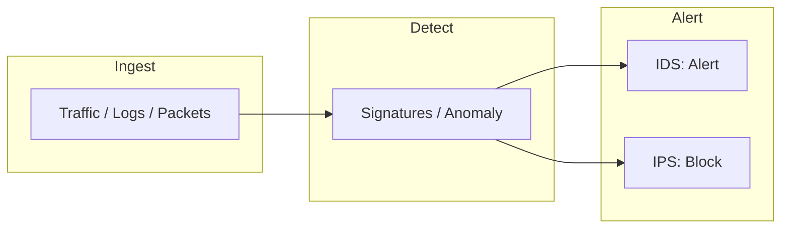

# IDS & IPS

- [Resources](#resources)
- [IDS & IPS Flowchart](#ids--ips-flowchart)

## Table of Contents

- [IDS & IPS Flowchart](#ids--ips-flowchart)

## IDS & IPS Flowchart

> **Read more:** For additional tools and references, see [Resources](#resources) below.

## Resources

| Name | Description | URL |
| --- | --- | --- |
| AutoHoneyPoC | AutoPoC Generator HoneyPoC | https://github.com/ZephrFish/AutoHoneyPoC |
| Canary Tokens | Generate canary tokens | https://canarytokens.org/generate |
| Certiception | An ADCS honeypot to catch attackers in your internal network. | https://github.com/srlabs/Certiception |
| HoneyCreds | HoneyCreds network credential injection to detect responder and other network poisoners. | https://github.com/Ben0xA/HoneyCreds |
| GoodKit | Rootkit for the blue team. Sophisticated and optimized LKM to detect and prevent malicious activity | https://github.com/SilverPlate3/GoodKit |
| NamedPipeMaster | a tool used to analyze and monitor in named pipes | https://github.com/zeze-zeze/NamedPipeMaster |
| NetAlertX | Network intruder and presence detector. Scans for devices connected to your network and alerts you if new and unknown devices are found. | https://github.com/jokob-sk/NetAlertX |
| Respotter | Respotter is a Responder honeypot. Detect Responder in your environment as soon as it's spun up. | https://github.com/lawndoc/Respotter |
| SSH Honeypot | This is a simple SSH Honeypot script written in Python. | https://github.com/Mickhat/SSH-Honeypot |
| teler | Real-time HTTP Intrusion Detection | https://github.com/teler-sh/teler |
| Thinkst Canary | Canary Tokens | https://canary.tools |
| Zeek | Zeek is a powerful network analysis framework that is much different from the typical IDS you may know. | https://github.com/zeek/zeek |

---

## More contents

| Subject | Description |
| --- | --- |
| Additional resources | See Resources (Zeek, honeypots, Canary, etc.). |
| IDS vs IPS | Detect vs block; see flowchart in this handbook. |

## More tables

| Reference | Location |
| --- | --- |
| Tools | Zeek, teler, Respotter, HoneyCreds in Resources. |
| Honeypots | SSH, Certiception, HoneyCreds; see Resources. |

## Tools and commands

| Category | Example |
| --- | --- |
| Zeek / detection | See Resources for Zeek and teler documentation. |
| Honeypot | Respotter, SSH Honeypot; see Resources links. |

## Payloads table

| Type | Description | Reference |
| --- | --- | --- |
| Trigger payloads | Requests that trigger IDS/IPS | See Resources (AutoHoneyPoC); test with Atomic Red Team. |
| Honeypot lures | Credentials, SSH keys, tokens | See HoneyCreds, Respotter, Canary in Resources. |

---

## Connections

**Tamilselvan Cybersecurity** — Connect · Network:

| Resource | Link |
| --- | --- |
| GitHub | https://github.com/Tamilselvan-S-Cyber-Security |
| Website | https://tamilselvan-official.web.app/ |
| LinkedIn | https://in.linkedin.com/in/tamil-selvan-383618304 |
