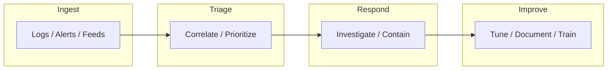

# Security Operations Center

- [Resources](#resources)
- [Security Operations Center Flowchart](#security-operations-center-flowchart)

## Table of Contents

- [Security Operations Center Flowchart](#security-operations-center-flowchart)

## Security Operations Center Flowchart

> **Read more:** For additional tools and references, see [Resources](#resources) below.

## Resources

| Name | Description | URL |
| --- | --- | --- |
| Awesome SOC | A collection of sources of documentation, as well as field best practices, to build/run a SOC | https://github.com/cyb3rxp/awesome-soc |
| MITRE ATLAS | Navigate threats to AI systems through real-world insights | https://atlas.mitre.org |
| MITRE ATT&CK | MITRE ATT&CK® is a globally-accessible knowledge base of adversary tactics and techniques based on real-world observations. | https://attack.mitre.org |
| MITRE ATT&CK - Enterprise - Cloud | Cloud Matrix | https://attack.mitre.org/matrices/enterprise/cloud |
| MITRE ATT&CK Navigator | Navigator | https://mitre-attack.github.io/attack-navigator/ |
| MITRE D3FEND | A knowledge graph of cybersecurity countermeasures | https://d3fend.mitre.org |
| MITRE ENGAGE | MITRE Engage is a framework for planning and discussing adversary engagement operations that empowers you to engage your adversaries and achieve your cybersecurity goals. | https://engage.mitre.org |
| SOC Interview Questions | Let's make this repository full of interview questions! | https://github.com/LetsDefend/SOC-Interview-Questions/ |
| Tamilselvan Cybersecurity | Connect · Network | https://github.com/Tamilselvan-S-Cyber-Security |
| Tamilselvan - Website | Personal portfolio & resources | https://tamilselvan-official.web.app/ |
| Tamilselvan - LinkedIn | Professional profile | https://in.linkedin.com/in/tamil-selvan-383618304 |

## Payloads table

| Type | Description | Reference |
| --- | --- | --- |
| Runbooks / playbooks | MITRE ATT&CK, ENGAGE, Navigator | See Resources (ATT&CK, D3FEND, ENGAGE). |
| SOC workflows | Triage, investigate, document | See Resources; SOC Interview Questions. |
