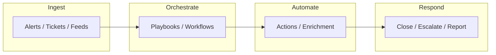

# SOAR & SecOps

- [Resources](#resources)
- [SOAR & SecOps Flowchart](#soar--secops-flowchart)

## Table of Contents

- [SOAR & SecOps Flowchart](#soar--secops-flowchart)

## SOAR & SecOps Flowchart

> **Read more:** For additional tools and references, see [Resources](#resources) below.

## Resources

| Name | Description | URL |
| --- | --- | --- |
| n8n | Fair-code workflow automation platform with native AI capabilities. Combine visual building with custom code, self-host or cloud, 400+ integrations. | https://github.com/n8n-io/n8n |
| Tracecat | The open source Tines / Splunk SOAR alternative for security and IT engineers. Built on simple YAML templates for integrations and response-as-code. | https://github.com/TracecatHQ/tracecat |
| Tamilselvan Cybersecurity | Connect · Network | https://github.com/Tamilselvan-S-Cyber-Security |
| Tamilselvan - Website | Personal portfolio & resources | https://tamilselvan-official.web.app/ |
| Tamilselvan - LinkedIn | Professional profile | https://in.linkedin.com/in/tamil-selvan-383618304 |

## Payloads table

| Type | Description | Reference |
| --- | --- | --- |
| Playbooks / workflows | n8n, Tracecat YAML; automation | See Resources table. |
| Response actions | Enrich, close, escalate | See SOAR & SecOps flowchart. |
