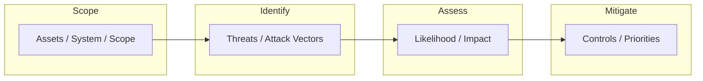

# Threat Modeling

- [Resources](#resources)
- [Threat Modeling Flowchart](#threat-modeling-flowchart)

## Table of Contents

- [Threat Modeling Flowchart](#threat-modeling-flowchart)

## Threat Modeling Flowchart

> **Read more:** For additional tools and references, see [Resources](#resources) below.

## Resources

| Name | Description | URL |
| --- | --- | --- |
| CISA Vulnrichment | A repo to conduct vulnerability enrichment. | https://github.com/cisagov/vulnrichment |
| Lockheed Martin Cyber Kill Chain | Developed by Lockheed Martin, the Cyber Kill Chain® framework is part of the Intelligence Driven Defense® model for identification and prevention of cyber intrusions activity. | https://www.lockheedmartin.com/en-us/capabilities/cyber/cyber-kill-chain.html |
| Unified Kill Chain | Raising resilience against advanced cyber attacks through threat modeling. | https://unifiedkillchain.com |

---

## More contents

| Subject | Description |
| --- | --- |
| Additional resources | See Resources (Kill Chain, D3FEND, Unified Kill Chain). |
| Threat modeling | Scope → Identify → Assess → Mitigate; see flowchart. |

## More tables

| Reference | Location |
| --- | --- |
| Frameworks | CISA Vulnrichment, Lockheed Martin, Unified Kill Chain in Resources. |
| Mapping | ATT&CK, Kill Chain; see Frameworks handbook. |

## Tools and commands

| Category | Example |
| --- | --- |
| Enrichment | CISA Vulnrichment; see Resources. |
| Modeling | Threat Dragon, Unified Kill Chain; see Resources. |

## Payloads table

| Type | Description | Reference |
| --- | --- | --- |
| Threat scenarios | Attack vectors, kill chain steps | See Resources (Kill Chain, Unified Kill Chain). |
| Mitigation mapping | D3FEND, control coverage | See Resources; see Frameworks handbook. |

---

## Connections

**Tamilselvan Cybersecurity** — Connect · Network:

| Resource | Link |
| --- | --- |
| GitHub | https://github.com/Tamilselvan-S-Cyber-Security |
| Website | https://tamilselvan-official.web.app/ |
| LinkedIn | https://in.linkedin.com/in/tamil-selvan-383618304 |
